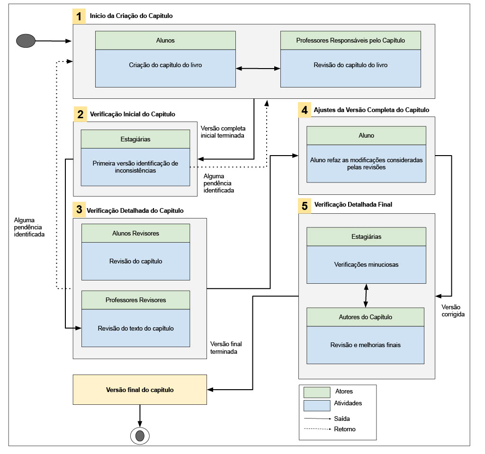

Este trabalho apresenta um relato de experiência de um projeto para criação de um livro, no qual os alunos são criadores de conteúdos. O projeto conta com a participação de 18 alunos na criação de conteúdos voltados para o desenvolvimento de software para Web. Foi adotada a metodologia de aprendizagem de sala de aula invertida na qual os alunos se tornam ativos no processo de aprendizagem. Como avaliação do projeto, os participantes responderam um formulário, onde foram levantados lições aprendidas e desafios do projeto. Esse relato pode apoiar professores e alunos para utilizar a experiência relatada neste trabalho para aplicação em seus cursos e disciplinas.

A figura a seuir apresenta as cinco etapas seguidas para criação dos capítulos do livro, tendo
como principais criadores de conteúdo os alunos participantes. 

Abaixo segue os capítulos que compõem o livro, bem como as descrições de cada capítulo.

| Título do capítulo                                                                 | Descrição do capítulo                                                                                                                                                       |
| ---------------------------------------------------------------------------------- | -------------------------------------------------------------------------------------------------------------------------------------------------------------------------------------- |
| TypScript e JavaScript                                                             | Demonstra as principais diferenças entre o JavaScript,   e o TypeScript.                                                                                                          |
| Frameworks para CSS                                                                | Apresenta os frameworks para CSS: Tailwind, Materialize   e BootStrap.                                                                                                               |
| Arquitetura de Software para Web                                                   | Apresenta as arquiteturas de software mais utilizadas na construção de sistemas Web: monolítica,   cliente-servidor, arquitetura orientada a mensagens   e publicador-consumidor. |
| Padrões de Projeto para Web                                                        | Discute e demonstra o uso de padrões de projeto na Web.                                                                                                                                |
| Desenvolvimento de front-end                                                       | Apresenta e demostrar várias formas de utilização do   React-Js.                                                                                                                   |
| Desenvolvimento de Back-end                                                        | Apresenta, demonstra exemplos de uso e discute as principais   diferenças entre as tecnologias: ASP.NET, Django Rest e   Node.js.                                              |
| Frameworks full stack para Web                                                     | Apresenta e demostra exemplos de uso dos frameworks   Laravel e Django para criação conjunto de back-end e   front-end.                                                           |
| Banco de dados para aplicações Web                                                 | Apresenta soluções em banco de dados para criação de   Interface de Programação de Aplicação (API).                                                                                  |
| Ferramentas para apoiar o   desenvolvedor para Web                              | Apresenta e demostra o uso de um conjunto ferramentas  que apoiam o desenvolvimento Web, tais como: GitHub,   Docker, WSO2 e Kafka.                                                  |
| Teste de Software para Web                                                         | Apresenta a criação de suíte de teste por meio das   ferramentas: Selenium e Cypress.                                                                                                |
| Manipulação de API                                                                 | Demostra o uso e identifica as principais diferenças entre   as APIs para aplicações WEB: RESTFUL,   GRAPHQL E RCL.                                                               |
| Web Semântica                                                                      | Apresenta e discute as principais ferramentas utilizadas   na Web Semântica.                                                                                                         |
| DevOps com foco na Web                                                             | Discute elementos da cultura DevOps   no contexto da Web, suas ferramentas e práticas.                                                                                             |
| Inteligência Artificial (IA) na Web                                                | Apresenta principais estratégias para o uso de IA para   apoiar o desenvolvimento para a Web.                                                                                        |
| Levantamento das principais Hard   Skills necessárias ao desenvolvedor   Web | Apresenta uma pesquisa que lista e discute as principais   Hard Skills necessárias ao desenvolvedor para Web.                                                                      |
| Usabilidade e acessibilidade na Web                                                | Apresenta e discute questões relacionadas a usabilidade   para Web.                                                                                                                  |
| Levantamento de requisitos para Web                                                | Discute abordagens para levantamento de requisitos com   foco em aplicações Web.                                       

[Aqui estão as planilhas com os resultados dos formulários de pesquisa utilizados no artigo:](https://github.com/Raquel-Luis-Duarte/wei2024/tree/main/Planilhas)

[Questionário](https://github.com/Raquel-Luis-Duarte/wei2024/blob/main/Planilhas/questionario_artigo_wei.pdf)

[Respostas do Formulário](https://github.com/Raquel-Luis-Duarte/wei2024/blob/main/Planilhas/RespostasDoFormulario%20.csv)

[Agrupamento de Perguntas por Tópicos]([https://github.com/Raquel-Luis-Duarte/wei2024/tree/main/Planilhas/](https://github.com/Raquel-Luis-Duarte/wei2024/blob/main/Planilhas/AgrupamentoPerguntas%20.csv))

[Codificação das Questões Subjetivas](https://github.com/Raquel-Luis-Duarte/wei2024/blob/main/Planilhas/QuestoesSubjetivas%20.csv)

